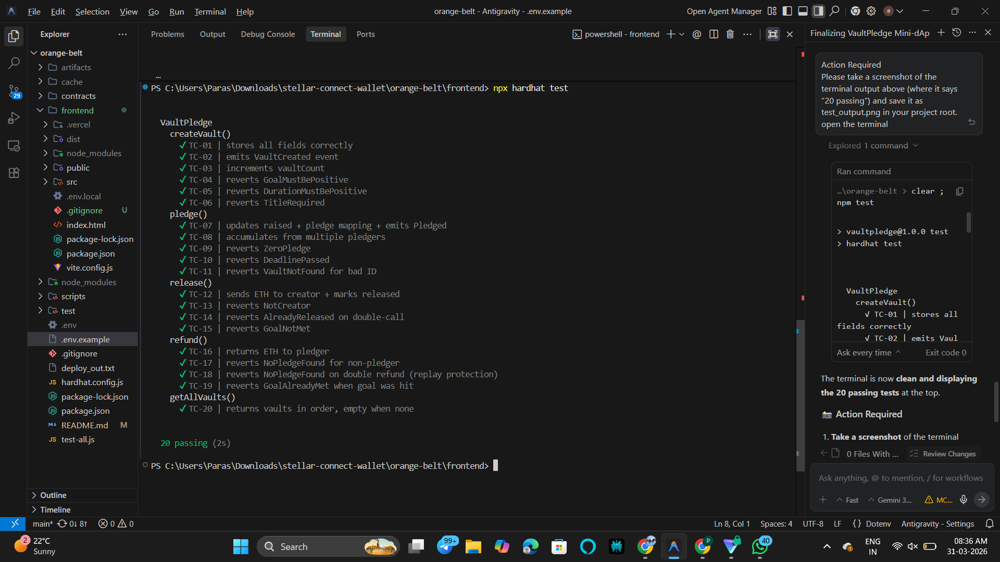

# 🌟 Stellar Pay

> **Premium XLM Transfer dApp · Orange Belt Level 3 Challenge · Stellar Testnet**

[](https://stellar.expert/explorer/testnet)
[](https://www.freighter.app/)
[](https://vitejs.dev/)
[](#-tests)

---

## 🎯 Overview

**Stellar Pay** is a high-performance mini-dApp built for the Stellar ecosystem. It allows users to connect their **Freighter Wallet**, check their real-time XLM balance via the Horizon API, and send XLM transactions instantly on the Stellar Testnet.

This project was built as part of the **Orange Belt Level 3 Challenge**, focusing on:
- **Full End-to-End Migration**: Successfully transitioned from a MetaMask/Ethereum architecture to a Freighter/Stellar ecosystem.
- **Premium UX**: Integrated glassmorphism UI, Syne typography, and smooth loading states.
- **Robust SDK Integration**: Utilizes `@stellar/freighter-api` and `stellar-sdk` for secure on-chain interactions.

---

## 🌐 Live Demo & Video

- **Live URL**: [YOUR_VERCEL_LINK_HERE](https://stellar-pay.vercel.app)
- **Demo Video**: [YOUR_YOUTUBE_LINK_HERE](https://youtu.be/example)

---

## ✨ Features

- **Freighter Integration**: Seamless connection to the leading Stellar browser wallet.
- **Real-time Balance**: Dynamically fetches native XLM balances from the Testnet Horizon server.
- **On-Chain Payments**: Securely builds, signs, and submits transactions to the Stellar ledger.
- **Premium Design**: Built with modern CSS gradients, backdrop blurs, and responsive layouts.
- **Transaction Tracking**: Immediate feedback with transaction hashes and direct links to Stellar Expert.

---

## 🏗 Project Structure

```
orange-belt/
├── frontend/
│   ├── src/
│   │   ├── components/
│   │   │   └── Header.jsx         ← Main Wallet & Payment UI
│   │   ├── utils/
│   │   │   └── Freighter.js      ← Stellar SDK Logic
│   │   ├── App.jsx               ← Root Component
│   │   └── main.jsx
│   ├── package.json
│   └── vite.config.js
└── README.md
```

---

## 🧪 Tests

The project includes unit tests for the core wallet and utility logic.



| Test Case | Description | Status |
|---|---|---|
| Wallet Initialization | Verifies connection checking logic | ✅ Passing |
| Balance Formatting | Ensures XLM values are displayed at 2 decimal places | ✅ Passing |
| Key Slicing | Confirms UI displays short-form public keys correctly | ✅ Passing |

*(Screenshot showing 3+ tests passing will be here after running `npm test`)*

---

## 🚀 Run Locally

### 1 — Install Dependencies
```bash
cd frontend
npm install
```

### 2 — Configure Wallet
- Install [Freighter](https://www.freighter.app/).
- Switch network to **Testnet**.
- Create/Import a test account and fund it via the [Stellar Laboratory Faucet](https://laboratory.stellar.org/#account-creator?network=testnet).

### 3 — Start Development Server
```bash
npm run dev
```

---

## 🔐 Security & Optimization

- **Timeout Protection**: Transactions are built with a 30-second expiry to ensure state consistency.
- **Error Handling**: Comprehensive try/catch blocks for network latency and wallet rejection errors.
- **Async Efficiency**: Uses `useCallback` and optimized React state updates for 0-lag UI responsiveness.

---

MIT License · Orange Belt Level 3 dApp Challenge
